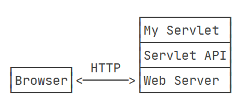
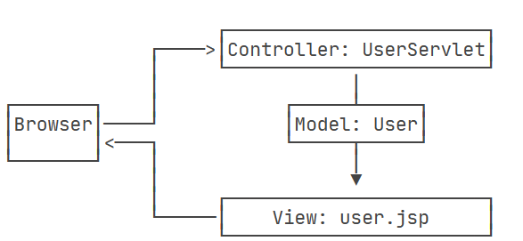
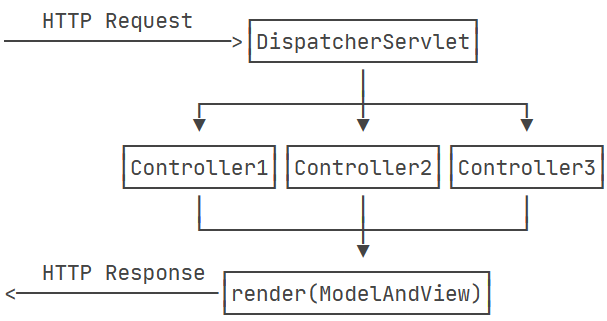
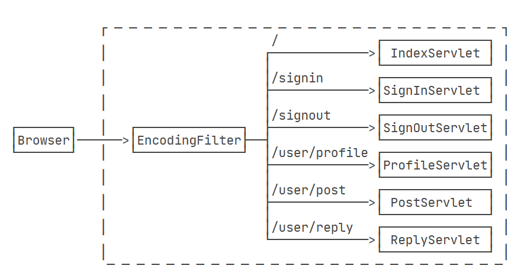
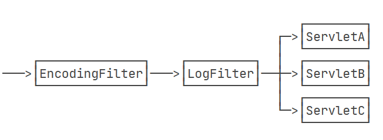

# Java基础

## Classpath

`jvm`用到的一个环境变量，用来指示`jvm`如何搜索`class`文件

只在启动`jvm`时设置`classpath`变量（不在系统环境变量中设置`classpath`，避免污染整个系统环境）

```
java -classpath .;C:\work\project1\bin;C:\shared abc.xyz.Hello
java -classpath .;C:\work\project1\bin;C:\shared abc.xyz.Hello
```

若未设置系统变量，也缺少`-cp`参数，则`jvm`的默认路径是当前目录 `.`

`jar`包：`class`文件的压缩包，该压缩包需要保持**完整正确**的目录结构

高版本的`JDK`可编译输出低版本的兼容文件，低版本的`JDK`可能不存在高版本的`JDK`添加的类和方法

## 模块化

自带“依赖关系”的`class`容器 - 解决依赖关系

`JRE`用创建的模块来打包`jre`

## 异常

## 反射

Reflection 程序可以在**运行期间**拿到一个对象的所有信息


# Web基础

## `Servlet`

使用servlet API来编写自己的servlet处理HTTP请求 Web服务器实现Servlet API接口，实现底层功能。



一个最简单的Servlet的例子：

```java
// WebServlet注解表示这是一个Servlet，并映射到地址/:
@WebServlet(urlPatterns = "/")
public class HelloServlet extends HttpServlet {
    protected void doGet(HttpServletRequest req, HttpServletResponse resp)
            throws ServletException, IOException {
        // 设置响应类型:
        resp.setContentType("text/html");
        // 获取输出流:
        PrintWriter pw = resp.getWriter();
        // 写入响应:
        pw.write("<h1>Hello, world!</h1>");
        // 最后不要忘记flush强制输出:
        pw.flush();
    }
}
```

Servlet API是一个jar包，通过maven引入并正常编译。

在tomcat等web服务器（或者称为servlet容器）上运行Servlet API服务。

在Servlet容器中运行Servlet具有如下特点：

- 无法在代码中直接通过new创建Servlet实例，必须由Servlet容器自动创建Servlet实例
- Servlet容器只会给每个Servlet类创建唯一实例
- Servlet容器会使用多线程执行`doGet()`或`doPost()`方法

### Servlet开发


## JSP开发

jsp - Java Server Pages

JSP的内容实际是一个HTML，但含有不同的语法规则。

## MVC开发

JavaBean:

```java
public class User {
    public long id;
    public String name;
    public School school;
}

public class School {
    public String name;
    public String address;
}
```

`UserServlet`: 从数据库中读取`user`,`school`等信息，将读取到的`JavaBean`先放入到`HttpServletRequest`，再通过`forward()`传给`user.jsp`。

```java
@WebServlet(urlPatterns = "/user")
public class UserServlet extends HttpServlet {
    protected void doGet(HttpServletRequest req, HttpServletResponse resp) throws ServletException, IOException {
        // 假装从数据库读取:
        School school = new School("No.1 Middle School", "101 South Street");
        User user = new User(123, "Bob", school);
        // 放入Request中:
        req.setAttribute("user", user);
        // forward给user.jsp:
        req.getRequestDispatcher("/WEB-INF/user.jsp").forward(req, resp);
    }
}
```

将UserServlet看作业务逻辑处理，将User看作模型，将user.jsp看作渲染

MVC - Model - View - Controller



使用普通的Java类实现MVC的Controller:

```java
public class UserController {
    @GetMapping("/signin")
    public ModelAndView signin() {
        ...
    }

    @PostMapping("/signin")
    public ModelAndView doSignin(SignInBean bean) {
        ...
    }
    
    @GetMapping("/signout")
    public ModelAndView signout(HttpSession session) {
        ...
    }
}
```

### 自定义实现MVC框架



创建一个接收所有请求的Servlet（DispatcherServlet）,根据不同的Controller的方法定义方法的Path决定调用哪个方法，获得ModelAndView后进行渲染模板，写入HTTPResponse。

### Filter



多个Filter之间可以形成一个链式关系



# Spring开发

一个支持快速开发Java EE应用程序的框架。

Spring Framework主要包含以下几个模块：

- 支持IoC和AOP的容器
- 支持JDBC和ORM的数据访问模块
- 支持声明式事务模块
- 支持基于Servlet的MVC
- 支持基于Reactive的Web开发
- 集成JMS JavaMail JMX 缓存等

### IoC容器

容器：为某种**特定组件**运行提供**软件环境**

`Tomcat 为Servlet运行提供运行环境` `DocKor 提供Linux环境便于运行一个Linux进程`

`IoC`容器：管理所有轻量级的JavaBean组件 

提供的底层服务：组件的生命周期管理、配置和组装服务，AOP支持，建立在AOP基础上的声明式事务

**`IoC`** Inversion of Control 控制反转

将组件的创建、配置与使用分开，通过注入的方式（java注解）

```xml
// 通过xml文件创建组件
// 在property标签中将id="dataSource"的组件通过该属性注入其他组件（实质时调用set方法）
<beans>
    <bean id="dataSource" class="HikariDataSource" />
    <bean id="bookService" class="BookService">
        <property name="dataSource" ref="dataSource" />
    </bean>
    <bean id="userService" class="UserService">
        <property name="dataSource" ref="dataSource" />
    </bean>
</beans>
```

```java
// 在Service中将DataSource通过setDateSource的方式注入组件
// 属性注入
public class BookService {
    private DataSource dataSource;

    public void setDataSource(DataSource dataSource) {
        this.dataSource = dataSource;
    }
}
// 构造方法注入
public class BookService {
    private DataSource dataSource;

    public BookService(DataSource dataSource) {
        this.dataSource = dataSource;
    }
}
```


​	

# Spring Boot开发


# Spring Cloud开发

