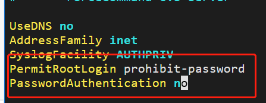

## 北交大Linux操作系统与网络编程：实验三 软件包的安装与配置

### **实验目的：**

​    在`Linux`环境中进行软件包的管理和安装，包括软件包的分类、软件包管理工具的使用和配置等；了解使用包管理器和使用源码进行软件安装的过程。

### **实验步骤：**

​    `Linux`中的软件包分类：`deb`包、`rpm`包、`tar`包

​    常见的下载软件包的命令`wget` `curl`

​    如：`$wget [repository address]`

​    不同格式的软件包，需要使用的解包命令也不同

- deb包 使用`dpkg`命令

- rpm包 使用rpm命令，常见的选项：`-p`表示查询 `-f`表示文件 `-v`表示安装          `-vh`显示基于hash值的提示信息

- tar包，使用tar命令完成解包

  - `tar -xzvf` 对应`.gz`格式的压缩包
  - `tar -jxvf`对应`.tar.bz2`格式的压缩包
  - 先使用`xz -d`可以将`.tar.xz`解压成`.tar`文件，而后使用`tar -xvf`完成基本tar包的解压

  yum: rpm系的包管理工具

  ​	从对应的repository解析描述对应软件依赖关系的`metadata`，正确生成拟安装软件包的依赖树。

  yum配置软件仓库的步骤：

  ```bash
  # yum软件仓库的配置，一般位于/etc/yum.repos.d，通过.repo文件，以及/etc/yum.conf文件完成具体配置
  # 查看已生效的仓库
  yum repolist all
  # 按照新配置（修改conf文件）更新配置
  yum makecache
  # 更新包依赖关系的元数据
  yum update
  ```

  `dnf`: yum++(加强版)

  dnf使用步骤：

  ```shell
  # 已下载
  dnf list installed
  # 可用
  dnf list avaliable
  # 查找
  dnf search nano
  # 下载
  dnf install nano
  # 查看软件包信息
  dnf info nano 
  # 查看具体来源于哪个软件包
  dnf provides /bin/ls
  # 卸载
  dnf erase nano
  dnf remove nano
  ```

  

### **实验练习：**

- git安装练习

从远程仓库下载，首先下载`IUS`软件仓库 - `ius-release package`

`yum install https://repo.ius.io/ius-release-el7.rpm https://dl.fedoraproject.org/pub/epel/epel-release-latest-7.noarch.rpm`


然后使用下载命令下载git，查看`IUS软件网站`发现它提供的最新版git是git236

`yum install git236`


查看`git` 版本

`git --version`


从软件源码下载git

下载源码

`wget -O /tmp/git-2.9.5.tar.gz   https://mirrors.edge.kernel.org/pub/software/scm/git/git-2.9.5.tar.gz  `


解压

`tar -zxf /tmp/git-2.9.5.tar.xz  -C /tmp/`


检验相关依赖

`./configure --prefix=/usr/local/git`


编译安装

`make && make install`


配置环境变量

`vim /etc/profile`

刷新

`source /etc/profile`


- `tmux`练习

创建一个`tmux`并使用`tmux ls`


如图所示是实现练习中的窗口结构：


### **实验总结：**

本次实验练习了使用源码和软件工具包下载新版git，了解两种方式下载软件的不同之处，并更加深入地了解在Linux环境中下载软件的细节和过程，对以后完成相关工作有较大帮助。练习使用`tmux`来管理会话与窗口，方便在Linux环境中执行多个任务。

## 北交大Linux操作系统和网络编程：实验四 shell编程

### **实验目的：**

​    练习shell编程，掌握管道相关知识，练习ssh登录远程服务器。

### **实验步骤：**

 认识 `$@` `$*`的区别：给`for-para-list.sh`赋予执行权限`chmox +x for-para-list.sh`


可以发现使用`$@`时for循环将参数作为**独立变量**依次输出，使用`@*`将参数作为**整体变量**(数组)循环输出

当不添加双引号时，输出结果与使用`"$@"`相同

练习for循环按组取值


管道与重定向

查看流属性


使用有命名管道


SSH

使用本云产品登录


练习使用私钥登录远程服务器


### **实验练习：**

1.编写一个shell脚本，直到输入“quit”或学号时会输出提示信息并退出，否则将持续要求用户输入

```shell
#!/bin/bash
while true; do
    read -p "请输入字符串或数字: " input
    if [[ $input = "quit" ]]; then
        echo "用户输入了quit，程序退出。"
        break
    elif [[ $input =~ ^[0-9]{8}$ ]]; then
        echo "用户输入了8位数字，程序退出。"
        break
    else
        echo "用户输入了: $input"
    fi
done
```

执行结果


2.试用脚本实现如下功能：（1）后台计数功能（1-1000计数）；（2）通过输入参数可以控制将计数的信息显示或不显示；（3）可以查询当前的计数状况

开始计数/显示数字


隐藏计数/显示计数状态


3.对于给定的如下脚本，请尝试使用不同的重定向命令，会有什么结果

分别执行以下重定向命令

`./redirect.sh > output.txt`将执行结果输出重定向到`output.txt`文件


输出错误信息：无法执行`cd` 命令; 将可以输出的信息写入到`output.txt`文件中

`./redirect.sh 2> error.txt`将标准错误重定向到`error.txt`文件


输出了正确信息，将错误信息输入到`error.txt`文件

`./redirect.sh > output.txt 2>&1` 将标准输出、标准错误输出到`output.txt`文件


将正确、错误的信息均输入到`output.txt`文件

4.修改Linux环境中的配置文件`sshd_config`




实现：用windows本机私钥方式登录远程服务器


使用本机生成的私钥`e:\\.myssh\\myssh`登录到远程服务器

### **实验总结：**

 本次实验练习shell编程，深入学习了shell编程的方法以及在进行shell编程中所需要注意的细节问题，对以后进行shell脚本的编写有较大的帮助；深入学习了ssh相关知识，对如何使用密钥登录远程服务器有更深刻的认识。

 

## 东北大学Linux操作系统：实验四 进程间通信

### **实验目的：**

​	本次实验共完成两个进程通信框架，分别是在Linux环境中用C语言实现实现消息队列以及生产者消费者模型，体会进程通信的特点，进一步练习在Linux环境中编程。

### **实验步骤：**

- 实现消息队列代码

> Server

```c
#include <stdio.h>
#include <stdlib.h>
#include <sys/types.h>
#include <sys/msg.h>
#include <sys/ipc.h>
#include <unistd.h>

#define MSGKEY 99

struct msgform {
	int mtype;
	char mtext[1000];
}msg;

void createChild(){
	pid_t pid;
	if((pid=vfork())<0){
		printf("vfork error\n");
		exit(1);
	}else if(pid==0){

		printf("Child process PID:%d.\n",getpid());
		/* 执行客户端程序 */
		char *argv[]= {"./messageclient", NULL};
		if(execv(argv[0],argv)<0){
			printf("subprocess eror");
			exit(1);
		}
	}else{
		printf("Parent process PID:%d.\n",getpid());
		sleep(1);
	}
}
int  msgqid;

void server() {
	msgqid=msgget(MSGKEY, 0777|IPC_CREAT);	/*创建KEY为99的消息队列*/
	createChild();
	
	do{
		msgrcv(msgqid, &msg, sizeof(struct msgform), 0, 0);   /*接收消息*/
		printf("server received\n");
	}while(msg.mtype != 1);

	msgctl(msgqid, IPC_RMID, 0);			/*删除消息队列*/
	exit(0);
}

main(){  
	server();
}
```

> Client

```c
#include <stdio.h>
#include <stdlib.h>
#include <sys/msg.h>
#include <sys/ipc.h>

#define MSGKEY 99 

struct msgform {  
	int mtype;
	char mtext[1000];
}msg;

int msgqid;

void client() {
	int i;
	msgqid=msgget(MSGKEY, 0777);		/*打开KEY为99的消息队列*/
	for(i=10; i>=1; i--) {
		msg.mtype=i;
		printf("client sent\n");
		msgsnd(msgqid, &msg, sizeof(struct msgform), 0);	/*发送消息*/
	}
	exit(0);
}

main(){ 
	client( );
}
```

- 实现生产者消费者代码

> pthread

```c
#include <stdio.h>
#include <stdlib.h>
#include <unistd.h>
#include <pthread.h>
#include <semaphore.h> 
 
/* 生产者的数目 */
#define producerNumber 3
/* 消费者的数目 */  
#define consumerNumber 4 
/* 缓冲区数目 */ 
#define M 6 
 
/* 生产者放置产品的位置 */
int in = 0;
/* 消费者取产品的位置 */  
int out = 0; 
/* 缓冲初始化为0， 开始时没有产品 */
int buff[M] = {0}; 
sem_t empty_sem;
sem_t full_sem;
pthread_mutex_t mutex;
 
int producer_id = 0;
int consumer_id = 0;
 
/* 打印缓冲情况 */
void print()
{
    int i;
    for(i = 0; i < M; i++)
        printf("%d ", buff[i]);
    printf("\n");
}
 
/* 生产者方法 */
void *product()
{
    int id = ++producer_id;
    
    while(1)
    {
    /* 用sleep的数量可以调节生产和消费的速度，便于观察 */
    sleep(1);
    
    sem_wait(&empty_sem);
    pthread_mutex_lock(&mutex); 
    
    in = in % M;
    buff[in] = rand()%10;
    printf("生产者%d向%d号缓冲区放入了一个数据%d: \t", id, in, buff[in]);  
    print();  
    ++in;
    
    pthread_mutex_unlock(&mutex);
    sem_post(&full_sem);
    }
}
 
/* 消费者方法 */
void *prochase()
{
    int id = ++consumer_id;
    while(1)
    {
        /* 用sleep的数量可以调节生产和消费的速度，便于观察 */
        sleep(1);
        
        sem_wait(&full_sem);
        pthread_mutex_lock(&mutex);
        
        out = out % M;
        printf("消费者%d从%d号缓冲区取出一个数据%d: \t", id, out, buff[out]);
        
        buff[out] = 0;
        print();
        ++out;
        
        pthread_mutex_unlock(&mutex);
        sem_post(&empty_sem);
    }
}
 
int main()
{
    /* 声明生产者线程的ID数组 */
    pthread_t id1[producerNumber];
    /* 声明消费者线程的ID数组 */ 
    pthread_t id2[consumerNumber]; 
    int i;
    int ret1[producerNumber];
    int ret2[consumerNumber];
    
    /* 初始化同步信号量 */
    int ini1 = sem_init(&empty_sem, 0, M); 
    int ini2 = sem_init(&full_sem, 0, 0);
    if(ini1 && ini2 != 0)
    {
        printf("sem init failed \n");
        exit(1);
    }
    
    /* 初始化互斥信号量的函数pthread_mutex_init(); */
    int ini3 = pthread_mutex_init(&mutex, NULL); 

    if(ini3 != 0)
    {
        printf("mutex init failed \n");
        exit(1);
    }
    /*创建producerNumber个生产者线程*/ 
    for(i = 0; i < producerNumber; i++)
    {
        ret1[i] = pthread_create(&id1[i], NULL, product, NULL);
        if(ret1[i] != 0)
        {
            printf("product%d creation failed \n", i);
            exit(1);
        }
    }
    
    /* 创建consumerNumber个消费者线程 */
    for(i = 0; i < consumerNumber; i++)
        {
        ret2[i] = pthread_create(&id2[i], NULL, prochase, NULL);
        if(ret2[i] != 0)
        {
            printf("prochase%d creation failed \n", i);
            exit(1);
        }
    }
    for(i = 0; i < producerNumber; i++)
    {
        pthread_join(id1[i],NULL);
    }
    
    for(i = 0; i < consumerNumber; i++)
    {
        pthread_join(id2[i],NULL);
    }
    
    exit(0);
}
```

### **实验结果：**

- 消息队列

  - 首先在父进程中执行Server程序，创建消息队列，并监听消息队列，

  - 在父进程中使用fork命令创建子进程，并在子进程中使用`execv()`系统调用client，client端口打开消息队列并写入消息

  实验效果如下：

  在子进程client中连续发送十条消息，存储到消息队列中，在父进程的server中监听消息队列。

  

- 生产者消费者模型

生产者消费者模型C代码在编译时需要添加 `-lpthread` ，这是因为`pthread`线程模块不是Linux内核下的标准库，需要添加				`-lpthread`来指定链接库的位置。

执行代码，形成如下效果：


可以看到，生产者和消费者线程不断依次操作缓冲区数据。

### **实验总结：**

​		本次实验中，分别进行了消息队列和生产者消费者两种线程通信的经典模型，通过编写实现的C语言代码，进一步理解LINUX内核中进程协作、通信的方式和设计思想，更加深入地了解在LINUX环境中编程并运行程序的过程，体会到它带来的便捷与自由，希望能在以后的工作学习中更加深入的了解LINUX，并尝试更加熟练地使用它，使得代码开发、运行更加简洁方便。

