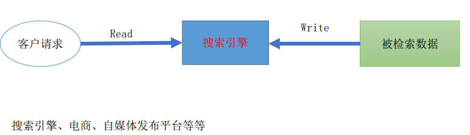
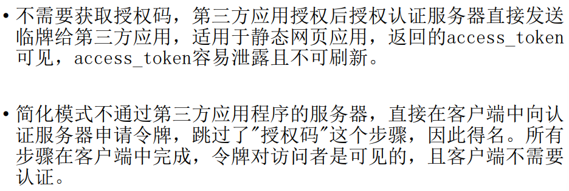

# CH01

## 大型平台架构

> 平台架构是针对平台设计与演进过程中所有关键问题的解决方案的总和。

分布式架构

> 将相同或不同的功能模块运行在**不同的机器**上，互相之间通过网络通信。

优势：分布式可水平扩展，应对高并发等特殊的场景。

微服务架构

> 将**单一应用程序**划分为一组小的服务，服务之间相互协调、配合，并采用轻量级的通讯协议沟通。每个服务都围绕具体的业务进行构建，并且能够被独立地部署到生产环境。

传统服务与微服务之间的区别

## 分布式架构和微服务架构的关系

微服务架构是分布式架构的一种特例，微服务架构一定是分布式的。

微服务架构基于分布式实现更多特性：

- 网络层协议标准化
- 数据层协议标准化
- 网络开发框架标准化
- 统一服务注册与发现机制
- 全链路分布式追踪
- 统一限流、熔断、降级、服务监控体系

## 大型平台的特点

高并发、高可用；数据量大；用户分布广泛，基数大，网络情况复杂；随用户需求持续迭代；有时间和技术的沉淀、渐进式的发展；安全环境恶劣。

## 大型平台的质量

### 性能

- 衡量指标：响应时间、并发数、吞吐量
- 响应时间：从请求发出到收到响应的时间
- 并发数：平台用户数 => 平台在线用户数 => 网站并发用户数
- 吞吐量：TPS(每秒事物数) HPS(每秒HTTP请求数) QPS(每秒查询数) 访问数/天        业务数/小时

#### 性能优化策略

- Web前端性能优化：
  - 浏览器访问优化
  - CDN(网站架构模式缓存)
  - 反向代理(网站架构模式缓存)
- 应用服务器性能优化
  - 负载均衡
  - 分布式
  - 集群
  - 缓存
  - 异步
- 存储性能优化
  - 主从分离
  - 分布式存储

### 可用性

衡量指标：一台或多台服务器宕机，系统仍然可用。(目标是达到7*24小时可用，四个9指全年99.99%的时间可用)。

#### 可用性优化策略

- 应用高可用
- 服务高可用
- 数据高可用
- 软件质量高可用

### 伸缩性

衡量指标：是否可以用多台服务器构建集群，是否能向集群中增减服务器，增减服务器之后是否可以保证像原来一样可用。让服务”无状态“。

### 扩展性

​	衡量指标：增加新的业务流程时，或基于已有业务流程扩展时，是否可以实现对现有业务透明无影响。

#### 优化策略

- 抽象可复用的基础服务，做好封装
- 松耦合设计
- 基于业务和即使的发展预见性设计

### 安全性

衡量指标：对攻击和窃密手段，是否有应对策略。

## 淘宝的演进过程

[淘宝演进过程]: D:\软件工程\作业\大三下作业\大型平台\大型平台分析与设计ch01.pdf

------

# CH02

## 分布式系统

### 分布式系统的特点

- 分布性

分布式系统中的多节点计算机会在空间上随意分布，同时，机器的分布情况可能会发生动态变化

- 对等性

分布式系统中的节点没有“严格”的主/从之分。 “副本”是分布式系统常见概念之一，指在数据或者服务上提供的一种冗余方式，这是解决数据 丢失以及局部服务异常的有效手段。

- 并发性

同一分布式系统下诸多节点会共享操作资源。

- 全局时钟

典型的分布式系统是一系列在空间上随意分布的诸多进程，且具备一定并 发性。那么在资源使用和响应的过程中，两个事件谁先谁后如何定义呢？

- 故障总是发生

一个被大量工程实践锁检验过的黄金定理：任何在设计阶段考虑到的异常 情况，一定会在系统实际运行过程中发生。且还会发生在设计时未考虑到 的异常故障。

### 分布式系统面临的典型问题

（1）解决高并发问题的分片策略、异步化任务调度等 

（2）解决分布式事务场景下数据一致性问题 

（3）解决数据分区或多副本场景下数据一致性问题 

（4）多节点中的不稳定、容灾等问题 

（5）高并发时的数据预期问题

> 案例

[分布式系统案例]: D:\软件工程\作业\大三下作业\大型平台\大型平台分析与设计ch02-刘宝.pdf

## CAP经典理论

一个分布式系统不可能同时满足Consistency|Availability|Partition toerance三个要求。

- 一致性

指数据的多个副本间能否保持一致的特性。

若：针对某一数据项的修改成功后，可使所有用户或业务场景立刻读取或感知到最新的值，则该系统就可以认为具有强一致性

- 可用性

系统提供的服务必须一直处于可用的状态，对于用户的所有请求都能够在“有限的时间”内“返回结果” 。

- 分区容错性

系统遇到任何网络分区故障的时候，仍然需要能够保证对外提供满足一致性和可用性的服务，除非整个网络环境都发生了故障。

## 高并发读写的设计原理

> 构建分布式系统的核心目的之一：支持高并发

### 高并发读

典型场景：搜索场景

应对策略：

1. 动静分离与CND加速
2. 加缓存 => (缓存雪崩 缓存击穿 大量热Key过期)
3. 异步化
4. 转批量（预读）
5. <u>重写轻读</u>

### 高并发写

1. 数据分片 DB分库分表 JDK的cueeentHashMap kafka的分区
2. 任务分片 多线程、归并思路
3. 异步化（LSM数 log structured merged）
4. 转批量

### 限流、熔断与降级

## 高可用

> 高可用的本质是为了减少故障发生的频率以及发生时长。

高可用的基本框架思维

1. 故障探测

   ”心跳检测“

   探测失败的可能原因：A进程宕机了 B进程所在的机器宕机了 C进程卡住了，无法响应心跳 D进程存活，但网络或者其他原因导致心跳检测异常。

2. 解决脑裂

   当发生上述场景C和D时，部分服务已经切换到了新的master，但此时旧的master其实还存活，这个时候数据就会错乱。这就是“脑裂”。

   A隔离。对旧的master隔离，直接杀死。 B每次新master上位，体系开启新的纪元，旧master感知自己的版本是旧的，于是主动下线。

3. 视业务场景做到数据一致性

   场景如下： A弱一致性。允许部分数据丢失。 B最终一致性。允许暂时的不一致。 C强一致性。不能容忍数据丢失。这里的场景比较复杂。

4. 对客户端尽量透明

   解决点对点问题：VIP、DNS、维护IP列表、使用名字服务、增加服务代理等等。

5. 要避免高可用依赖的连环问题

> 解决数据一致性算法

Paxos 	==Raft== 	Zab

> Raft算法

- 包含三类角色

Leader（领袖）：领袖由群众投票选举得出，每次选举，只能选出一名领袖；

Candidate（候选人）：当没有领袖时，某些群众可以成为候选人，然后去竞争领袖的位置； 

Follower（群众）

- 概念

Leader Election（领导人选举）：简称选举，就是从候选人中选出领袖； 

Term（任期）：它其实是个单独递增的连续数字，每一次任期就 会重新发起一次领导人选举；

Election Timeout（选举超时）：就是一个超时时间，当群众超 时未收到领袖的心跳时，会重新进行选举。

[Raft算法实现简介]: D:\软件工程\作业\大三下作业\大型平台\大型平台分析与设计ch02-刘宝.pdf

### 运维层面

> 冷备和热备

冷备：

热备：“多活”，在日常状态下需要承担流量

### 多活部署

> 同城容灾

在同城或相近的区域内，建立两个数据中心：一个为数据中心，负责日常生产运行；另一个为灾难备份中心，负责在灾难发生后的应用系统运行。

> 异地容灾

主备中心之间的距离较远(>200km)，因此一般采用异步镜像，会有少量的数据丢失。

异地容灾往往是冷备。

*经典架构*：两地三中心

同城双中心，异地灾备。

> 企业案例分析
>
> [企业案例分析]: D:\软件工程\作业\大三下作业\大型平台\大型平台分析与设计ch02-刘宝.pdf

## 分布式事务

### 事务

包含一系列操作的、一个有边界的工作序列，有明确的开始和结束标志，且要么被完全地执行，要么完全失败。通常情况下，事务指本地事务，也即在单机上的事务。

### 分布式事务

分布式事务指事务的参与者、支持事务的服务器、资源服务器以及事务管理器分别位于 不同的**分布式系统**的不同的节点之上。

> 泛指：在分布式场景下，按预期达成的数据一致性要求。

- 常见问题

- 解决方案 

  经典2pc理论

​	3pc理论

- 企业常见解决方案 利用消息

核心：将分布式场景转换为本地事务

- 事务消息 RocketMQ

- 事务消息 基于kafka自研

- 事务状态表 事务补偿

- 同步多写 异步对账

- 最终一致性

> 分布式事务开源解决方案 Seata

[Seata]: D:\软件工程\作业\大三下作业\大型平台\大型平台分析与设计ch02-刘宝.pdf

## 分布式存储

### Ceph

Ceph是一个分布式存储系统(由C++编写完成，提供软件定义、统一存储解决方案)，根据存储类型可分为块存储、对象存储和文件存储；

> 缺点

> 优点

### Redis集群

> 演进历史

### 数据库拆分

> 拆表方式

- 水平拆分

统一一个表的数据拆到不同的库不同的表中，可以根据时间、地区、或某个业务键维度，也可以通过hash进行拆分，最后通过路由访问到具体的数据。拆分后每个表结构保持一致。

- 垂直拆分

把一个有很多字段的表给拆成多个表

# CH03

## 微服务

一种架构模式，将大型系统或者复杂的应用分割成多个服务的架构，服务之间相互协调配合，为用户提供最终价值。	

每个服务都有独立的生命周期，可以单独维护和部署，各个业务模块遵循松耦合的设计。

> 微服务的拆分原则

> 微服务案例说明
>
> [微服务案例]: D:\软件工程\作业\大三下作业\大型平台\大型平台分析与设计ch03-刘宝.pdf

### 微服务安全认证

基于Spring Security结合Auth2和JWT实现安全认证和鉴权。

### Auth2.0

### 认证方式

#### 授权码模式

#### 简化模式

#### 密码模式

#### 客户端模式

### 令牌的更新与使用

### 关键问题

> 集中配置

> 分布式事务

> 同步调用

### 微服务设计原则

1. 单一职责

   

2. 充分必要

   

3. 内聚解耦

   

4. 开闭原则

   

5. 无状态服务

   

6. 统一原则

   

7. 简单可靠

   

### 微服务的注册与发现

主流的注册中心： Eureka | ZooKeeper

[微服务注册]: D:\软件工程\作业\大三下作业\大型平台\大型平台分析与设计ch03-刘宝.pdf

### 分布式锁

[ZooKeeper锁]: D:\软件工程\作业\大三下作业\大型平台\大型平台分析与设计ch03-刘宝.pdf

